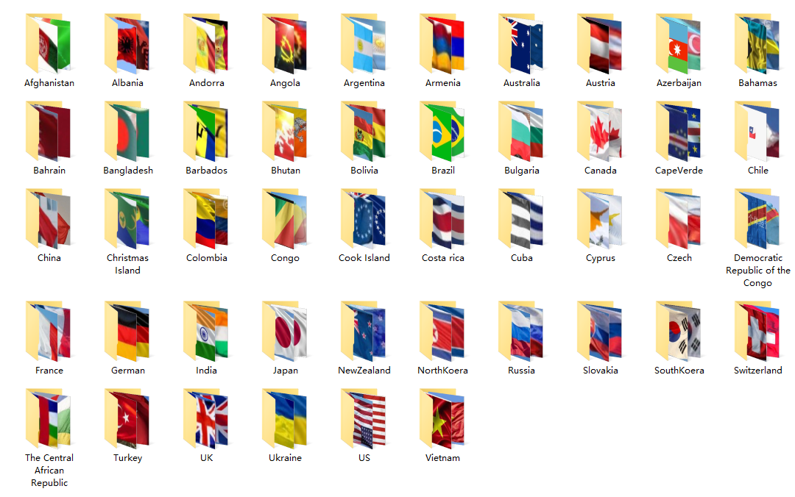

# Flag-Classification 国旗分类

该项目基于PyTorch框架，在一定程度上使用了开源的ResNet 50部分代码。(本人并未对原有的ResNet 50部分的代码做过多的修饰与更改，原作者的注释得到了充分的保留。)

本项目提供了数据集和本人在Titan XP上训练完成的检测模型。

(当我回忆起我采用了哪位dalao的代码以后，我会在此注明引用来源，并表示感谢)

## 1 简介

### 1.1 支持的国旗类别
本项目提供了数据集，并提供了基于本数据集训练完成的模型。
该项目可以完成对64种国旗的分类，涵盖了世界上主要国家，同时根据基于字典序的国家列表从头选择了一部分国家。

（该项目具有一定的可扩展性，欢迎更多的开发者完善数据集）

以下是本项目中所涵盖的国家列表：

### 1.2 数据集

训练集共有46个类别，每个国家有30张国旗图片，图片搜集自网络。由于个别国家过于小众，国旗来源稀缺，故处于平衡样本的考虑，所有国家均保留了30张。
盈余的图片被划入测试集。

- 训练集

链接：https://pan.baidu.com/s/1MFo9bCe_CoZ5WSl6iUu1og 

提取码：o6u0
- 测试集

链接：https://pan.baidu.com/s/1k13flpGrmdhEvPjFxztY-g 

提取码：8okd

## 2 如何启动

### 2.1 数据集的准备

数据集的结构十分简单，我们只需按照上图的形式将各个国家的图片放入对应的文件夹中即可，图片的命名无限制，以png为后缀，所在的文件夹名即该图片的label。

将准备好的各国国旗文件夹放到项目的".\train_dataset\"目录下。

### 2.2 训练

运行“1.train.py”，开始模型的训练。

PS：本人训练完成的模型已经上传到了百度网盘，也可以直接下载下来放到model文件夹

链接：https://pan.baidu.com/s/1X52NpARBa2H84yKXli_faA 

提取码：ssin

### 2.4 使用训练完成的模型

要使用训练完成的模型进行预测，可以参考本人写的一个小demo “2.predict.py”，
该demo里测试集的文件家结构要同训练集一致，这样label和索引才能起到对应关系。

若要对本项目进行进一步的应用，本人建议在训练时建立一个字典(dict)来存储各个标签与索引之间的对应关系，以方便根据输出结果得到预测标签。
